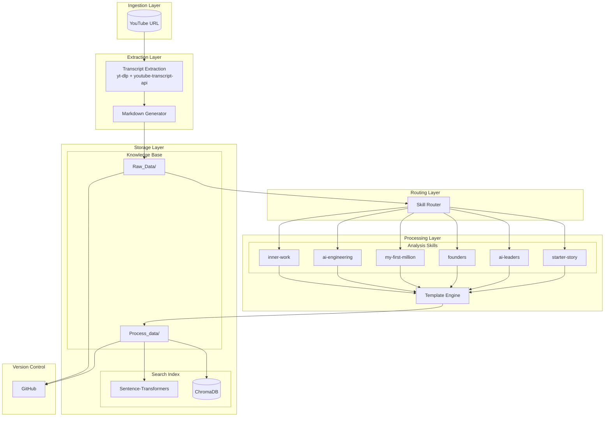
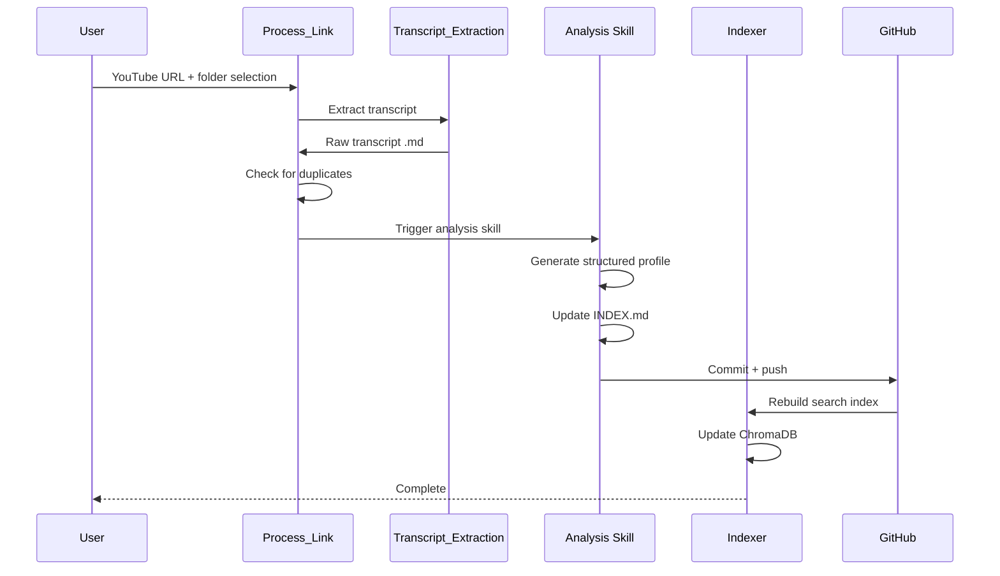
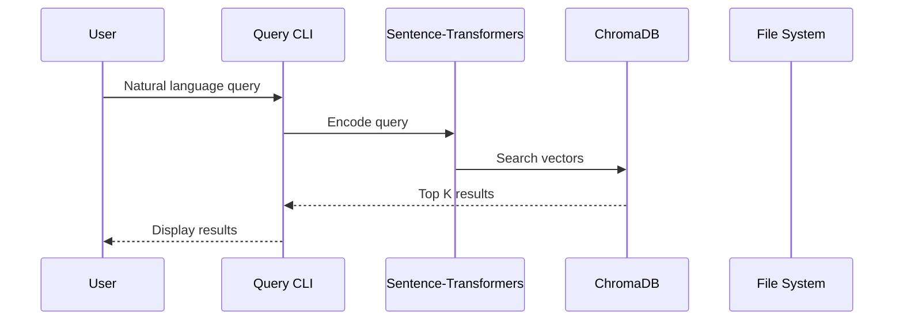

# Knowledge OS - Architecture Documentation

## System Overview

Knowledge OS is an autonomous agent system that transforms unstructured content (YouTube videos) into structured, searchable knowledge profiles. It combines transcript extraction, AI-powered analysis skills, vector-based semantic search, and Git-based storage.

---

## High-Level Architecture



---

## Component Breakdown

### 1. Ingestion Layer

**Purpose:** Accept content from external sources

| Component | Technology | Responsibility |
|-----------|------------|----------------|
| YouTube URL Input | Manual | User provides video URL |
| Transcript Extraction | `yt-dlp` | Fetch video metadata |
| Transcript Retrieval | `youtube-transcript-api` | Get transcript text |

**Data Flow:**
```
YouTube URL → video_id extraction → metadata fetch → transcript API → markdown file
```

---

### 2. Extraction Layer

**File:** `Transcript_Extraction.py`

**Responsibilities:**
- Parse YouTube URL to extract video ID
- Fetch video metadata (title, channel, duration, views)
- Retrieve transcript text
- Generate markdown with YAML frontmatter
- Save to appropriate folder

**Output Format:**
```markdown
---
video_id: dQw4w9WgXcQ
title: "Video Title"
channel: "Channel Name"
duration: 1200
view_count: 50000
upload_date: 20240115
tags: ["tag1", "tag2"]
thumbnail: https://...
---

[Transcript text]
```

---

### 3. Routing Layer

**Purpose:** Determine which analysis skill to apply

**Skill Routing Table:**

| Input Folder | Skill Triggered | Content Type |
|--------------|-----------------|--------------|
| Starter_Story | starter-story | Startup founder interviews |
| AI_Leaders | ai-leaders | AI industry leader interviews |
| Founders | founders | Business history & analysis |
| My_First_Million | my-first-million | Business podcast episodes |
| AI_Engineering | ai-engineering | AI development tutorials |
| Inner_Work | inner-work | Spiritual & personal growth |

---

### 4. Processing Layer

**Analysis Skills (6 total):**

#### starter-story
- **Input:** Raw transcript from Starter_Story folder
- **Output:** Startup profile with Executive Summary, Product, Tech Stack, Distribution, Frameworks, Metrics
- **Template:** 6-section structured format

#### ai-leaders
- **Input:** Raw transcript from AI_Leaders folder
- **Output:** Intelligence profile with AI Thesis, Mental Models, Contrarian Views, What They're Building

#### founders
- **Input:** Raw transcript from Founders folder
- **Output:** Founder profile with Books section (mandatory), Key Lessons, Notable Quotes, Journey

#### my-first-million
- **Input:** Raw transcript from My_First_Million folder
- **Output:** Business insight profile with Key Insights, Lessons, Resources (books)

#### ai-engineering
- **Input:** Raw transcript from AI_Engineering folder
- **Output:** Technical profile with Core Framework, Step-by-Step Implementation, Tools, Books

#### inner-work
- **Input:** Raw transcript from Inner_Work folder
- **Output:** Wisdom profile with Core Wisdom, Key Principles, Practical Application, Quotes

---

### 5. Storage Layer

#### File-Based Storage (Markdown)

```
Knowledge_OS/
├── [Category]/
│   ├── INDEX.md              # Master index
│   ├── Raw_Data/             # Original transcripts
│   │   └── [video_id]_[title].md
│   └── Process_data/         # Analyzed profiles
│       └── [Name]-[Topic]-YYYY.md
```

**INDEX.md Format:**
```markdown
# [Category] INDEX

| Entity | Topic | Type | Primary Reference | Date Added |
|--------|-------|------|-------------------|------------|
| Marc Lou | 35 Startups | solopreneur | - | 2026-05-02 |
```

#### Vector Search Storage

| Component | Technology | Purpose |
|-----------|------------|---------|
| Vector Database | ChromaDB (PersistentClient) | Store embeddings |
| Embedding Model | all-MiniLM-L6-v2 | Generate semantic vectors |
| Storage Path | `search/knowledge_db/` | Local file storage |

---

### 6. Version Control Layer

**Git Workflow:**
- All changes automatically committed
- Structured commit messages:
  - `Add transcript: [title]`
  - `Add starter story: [founder] - [company]`
  - `Add AI Leaders: [Person] - [Topic]`
- Pushed to GitHub automatically

---

## Data Flow Diagrams

### Full Processing Flow



### Search Flow



---

## File Structure

```
Knowledge_OS/
│
├── # Core System Files
├── Transcript_Extraction.py    # YouTube transcript extraction
├── AGENTS.md                   # Root agent instructions
├── README.md                   # Project overview
├── ARCHITECTURE.md             # This file
├── GETTING_STARTED.md          # Quick start guide
├── DB_Plan.md                  # Search implementation plan
├── Improvement.md              # Future improvements
│
├── # Content Folders (6 categories)
├── Starter_Story/
│   ├── AGENTS.md
│   ├── INDEX.md
│   ├── Raw_Data/
│   └── Process_data/
│
├── AI_Leaders/
│   ├── AGENTS.md
│   ├── INDEX.md
│   ├── Raw_Data/
│   └── Process_data/
│
├── Founders/
│   ├── AGENTS.md
│   ├── INDEX.md
│   ├── Raw_Data/
│   └── Process_data/
│
├── My_First_Million/
│   ├── AGENTS.md
│   ├── INDEX.md
│   ├── Raw_Data/
│   └── Process_data/
│
├── AI_Engineering/
│   ├── AGENTS.md
│   ├── INDEX.md
│   ├── Raw_Data/
│   └── Process_data/
│
├── Inner_Work/
│   ├── AGENTS.md
│   ├── INDEX.md
│   ├── Raw_Data/
│   └── Process_data/
│
├── # Search System
├── search/
│   ├── index.py              # Build vector index
│   ├── answer_search.py      # Query interface
│   ├── knowledge_db/         # ChromaDB storage
│   ├── requirements.txt
│   └── answer_search.py
│
├── # Skills (Analysis Logic)
├── Skills/
│   ├── AGENTS.md
│   ├── README.md
│   ├── Process_Link/
│   ├── starter-story/
│   ├── ai-leaders/
│   ├── founders/
│   ├── my-first-million/
│   ├── ai-engineering/
│   └── inner-work/
│
└── # Assets
└── assets/
    └── icon.png
```

---

## Technology Decisions

### Why These Technologies?

| Component | Choice | Rationale |
|-----------|--------|-----------|
| **Transcript** | yt-dlp + youtube-transcript-api | Reliable, free, no API key needed |
| **Vector DB** | ChromaDB | Local-only, no server, Python-native |
| **Embeddings** | all-MiniLM-L6-v2 | Fast (40ms), small (2.8M params), quality |
| **Storage** | Markdown + Git | Human-readable, version control, Obsidian-compatible |
| **Search UI** | CLI | Simple, no web dependencies |

### Trade-offs Made

| Decision | Trade-off |
|----------|-----------|
| Local ChromaDB | No cloud sync, but 100% private |
| CLI search | No GUI, but simple to maintain |
| Markdown storage | Less structured than SQL, but Obsidian-compatible |
| YouTube only | Limited sources, but reliable |

---

## Scalability Considerations

### Current Limitations

| Limitation | Impact | Potential Solution |
|------------|--------|-------------------|
| Local storage | Single user | Cloud storage adapter |
| CLI interface | No web UI | FastAPI wrapper |
| YouTube only | Limited sources | Add RSS, PDF, web scraping |
| Manual index updates | New content not searchable | Background indexer |

### Future Enhancements

See [Improvement.md](Improvement.md) for the full roadmap.

---

## Error Handling

### Current Error Handling

| Scenario | Handling |
|----------|----------|
| Invalid YouTube URL | Print error, exit |
| Transcript unavailable | Print error, continue |
| Duplicate video | Ask user to overwrite/skip |
| Git push failure | Print error, log for retry |
| Search index empty | Prompt to run index.py |

### Future Improvements

- Retry circuits for API calls
- Structured logging (structlog)
- Error tracking (Sentry integration)
- Health check endpoints

---

## Security Considerations

- All data stored locally (no external API calls for storage)
- GitHub credentials stored in local git config
- No sensitive data in code or config files
- YouTube transcripts are public data

---

## Related Documentation

- [README.md](../README.md) - Project overview
- [GETTING_STARTED.md](../GETTING_STARTED.md) - Quick start
- [Skills README.md](Skills/README.md) - Skills documentation
- [DB_Plan.md](../DB_Plan.md) - Search system details
- [Improvement.md](../Improvement.md) - Future roadmap

---

*Last Updated: 2026-05-02*
*Knowledge OS Architecture Documentation*