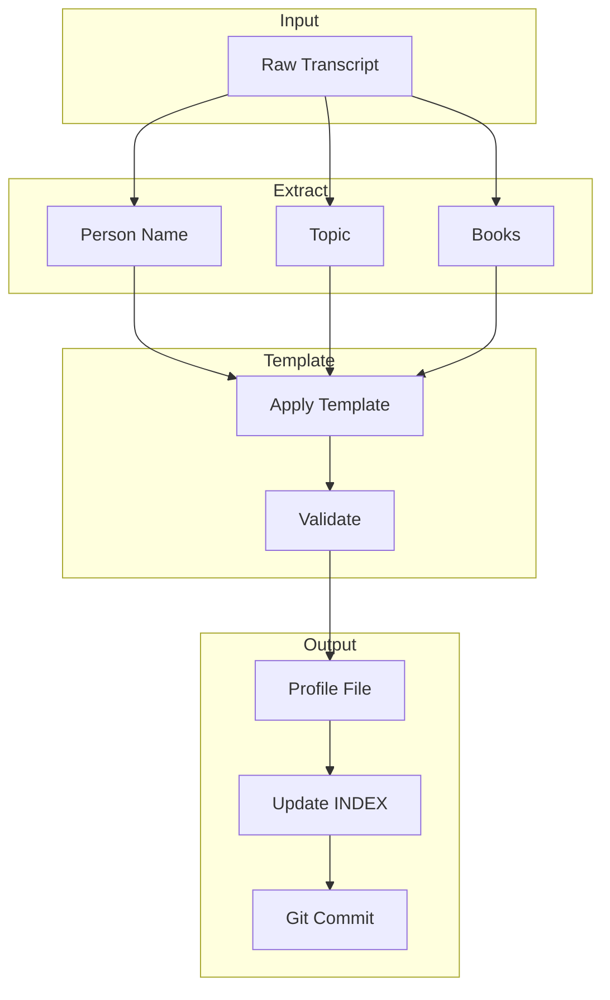

# Skills Documentation

This directory contains the analysis skills that power Knowledge OS. Each skill transforms raw transcripts into structured profiles.

---

## Overview

Skills are autonomous agents that process specific content types. When a transcript is saved to a folder, the corresponding skill automatically triggers to analyze it.

---

## Available Skills

| Skill | Folder | Trigger | Description |
|-------|--------|---------|-------------|
| **add-content-folder** | - | Manual | Create new content folders |
| **delete-content-folder** | - | Manual | Delete content folders |
| **Process_Link** | Process_Link | Manual | Extracts YouTube transcripts |
| **starter-story** | Starter_Story | Auto | Startup founder profiles |
| **ai-leaders** | AI_Leaders | Auto | AI industry leader profiles |
| **founders** | Founders | Auto | Business history & analysis |
| **my-first-million** | My_First_Million | Auto | Business podcast insights |
| **ai-engineering** | AI_Engineering | Auto | Technical AI frameworks |
| **inner-work** | Inner_Work | Auto | Personal growth wisdom |

---

## Skill Architecture

### How Skills Work



### Each Skill Provides:

1. **Input handling** - Where to read the transcript from
2. **Entity extraction** - What to pull from the content
3. **Template** - How to structure the output
4. **Validation** - Quality checks
5. **Output** - Where to save the profile
6. **INDEX update** - Master index entry
7. **Git workflow** - Commit and push

---

## add-content-folder Skill

**Purpose:** Create new folder structures with corresponding analysis skills

**Input:** Folder name from user

**Output:** New folder structure in Knowledge_OS/

**Process:**
1. Get folder name from user
2. Validate folder doesn't exist
3. Ask for optional description & custom sections
4. Create folder structure (AGENTS.md, INDEX.md, Raw_Data/, Process_data/)
5. Create analysis skill in Skills/
6. Update Process_Link skill (available folders + skill chaining)
7. Update AGENTS.md
8. Push to GitHub

**Trigger phrases:**
- "add a new folder"
- "create new content category"
- "add new skill folder"

---

## delete-content-folder Skill

**Purpose:** Delete content folders along with their related skills and all references

**Input:** Folder name from user

**Process:**
1. Get folder name
2. List contents (show what's being deleted)
3. **Require user confirmation** (CRITICAL)
4. Delete folder in Knowledge_OS/
5. Delete skill in Skills/
6. Update Process_Link (remove from folders & skill chaining)
7. Update AGENTS.md files
8. Rebuild search index
9. Push to GitHub

**Trigger phrases:**
- "delete a folder"
- "remove content folder"
- "delete skill"

**Protected folders:** Process_Link, add-content-folder, delete-content-folder

---

## Process_Link Skill

**Purpose:** Extract transcripts from YouTube videos

**Trigger phrases:**
- "Process_Link"
- "process link"
- "extract transcript"
- "get transcript from youtube"

**Input:** YouTube URL + folder selection

**Output:** Raw transcript saved to `Raw_Data/`

**Process:**
1. Validate YouTube URL
2. Extract video ID
3. Fetch metadata (title, channel, duration)
4. Retrieve transcript
5. Generate markdown with YAML frontmatter
6. Save to specified folder

**Files:**
- `Process_Link/SKILL.md` - Full documentation
- `Process_Link/references/folder_structure.md` - Folder descriptions

---

## starter-story Skill

**Purpose:** Transform founder interviews into startup profiles

**Input:** `Starter_Story/Raw_Data/*.md`

**Output:** `Starter_Story/Process_data/[Founder]-[Company]-YYYY.md`

**Template Sections:**
- Executive Summary
- The Product (What, Gap, Unfair Advantage)
- Tech Stack & Process
- Distribution Playbook
- Frameworks & Lessons
- Key Metrics

**Trigger:** Auto-triggers when transcript saved to Starter_Story folder

---

## ai-leaders Skill

**Purpose:** Create intelligence profiles on AI industry leaders

**Input:** `AI_Leaders/Raw_Data/*.md`

**Output:** `AI_Leaders/Process_data/YYYY-[Person]-[Topic].md`

**Template Sections:**
- AI Thesis
- Mental Models
- Contrarian Views
- What They're Building
- Blind Spots
- Naval-Style Maxims

**Trigger:** Auto-triggers when transcript saved to AI_Leaders folder

---

## founders Skill

**Purpose:** Analyze David Senra's Founders Podcast

**Input:** `Founders/Raw_Data/*.md`

**Output:** `Founders/Process_data/[Person]-[Topic]-YYYY.md`

**Template Sections:**
- Full Context
- Books & References (MANDATORY)
- Core Philosophy
- Key Lessons
- Notable Quotes
- Journey & Achievements
- Key Metrics

**Special Feature:** Handles both interview and analysis episode types

**Trigger:** Auto-triggers when transcript saved to Founders folder

---

## my-first-million Skill

**Purpose:** Process My First Million podcast episodes

**Input:** `My_First_Million/Raw_Data/*.md`

**Output:** `My_First_Million/Process_data/[Guest]-[Topic]-YYYY.md`

**Template Sections:**
- Executive Summary
- Key Insights
- Lessons
- Notable Quotes
- Resources & Books

**Adaptability:** Unifies brainstorm, interview, and breakdown episode types

**Trigger:** Auto-triggers when transcript saved to My_First_Million folder

---

## ai-engineering Skill

**Purpose:** Transform AI development content into technical profiles

**Input:** `AI_Engineering/Raw_Data/*.md`

**Output:** `AI_Engineering/Process_data/[Framework]-YYYY.md`

**Template Sections:**
- Executive Summary
- Core Framework / Concept
- Step-by-Step Implementation
- Tools & Technologies
- Books & Resources
- Key Insights
- Action Items

**Categories:** agentic-ai, vibe-coding, automation, llm-patterns, tool-use

**Trigger:** Auto-triggers when transcript saved to AI_Engineering folder

---

## inner-work Skill

**Purpose:** Process spiritual and personal growth content

**Input:** `Inner_Work/Raw_Data/*.md`

**Output:** `Inner_Work/Process_data/[Teacher]-[Topic]-YYYY.md`

**Template Sections:**
- Full Context
- Core Wisdom
- Key Principles
- Practical Application
- Notable Quotes
- Resources & References

**Categories:** spirituality, philosophy, psychology, personal-growth, kabbalah, mysticism

**Trigger:** Auto-triggers when transcript saved to Inner_Work folder

---

## Creating a New Skill

To add a new skill, simply use the **add-content-folder** skill:

1. **Trigger:** "add a new folder" or "create new content category"
2. **Provide folder name:** e.g., "AI_Products"
3. **Optional:** Add description and custom sections
4. **Done:** The skill creates everything automatically

Alternatively, manually:

1. **Create folder:** `Skills/my-new-skill/`
2. **Create SKILL.md:** Document purpose, input, output, template
3. **Implement logic:** Write code to transform transcript
4. **Update routing:** Add to skill chain in Process_Link

### Minimum SKILL.md Structure:

```markdown
# Skill Name

## Purpose
[What this skill does]

## Trigger
[When it activates]

## Input
[Where it reads from]

## Output
[Where it writes to]

## Template
[How it structures output]

## Process
[Step-by-step workflow]
```

---

## Skill Chaining

Skills can trigger other skills:

```
Process_Link → starter-story → GitHub Push
Process_Link → founders → GitHub Push
Process_Link → inner-work → GitHub Push
```

This enables:
- Sequential processing
- Quality gates
- Multi-stage analysis

---

## Best Practices

### For Skill Authors

1. **Clear templates** - Consistent output format
2. **Required fields** - Mark fields as mandatory (like books in founders)
3. **Error handling** - Graceful failures with helpful messages
4. **Validation** - Check output before saving
5. **INDEX updates** - Always update master index
6. **Git workflow** - Commit and push automatically

### For Template Design

1. **Use emojis** - Visual scanning
2. **White space** - Heavy separation between sections
3. **Quotes** - Blockquotes for key insights
4. **Bold** - Important terms and numbers
5. **Lists** - Bullet points for readability

---

## Testing Skills

Each skill should have:

- [ ] Input validation
- [ ] Transcript parsing
- [ ] Template generation
- [ ] File writing
- [ ] INDEX update
- [ ] Git commit

---

## Related Documentation

- [ARCHITECTURE.md](../ARCHITECTURE.md) - System architecture
- [GETTING_STARTED.md](../GETTING_STARTED.md) - Quick start guide
- [docs/workflow.md](../docs/workflow.md) - Detailed workflows

---

*Last Updated: 2026-05-02*
*Skills Documentation*