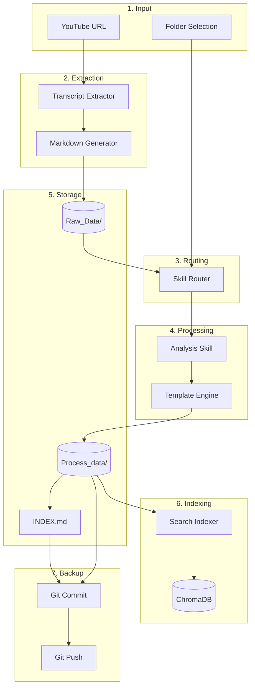
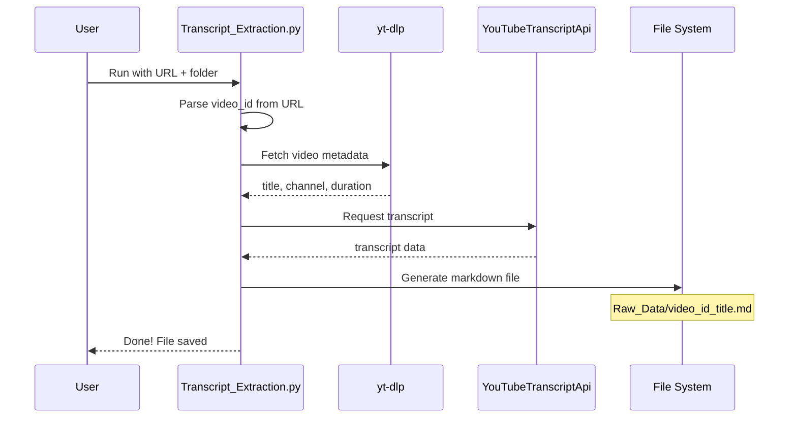
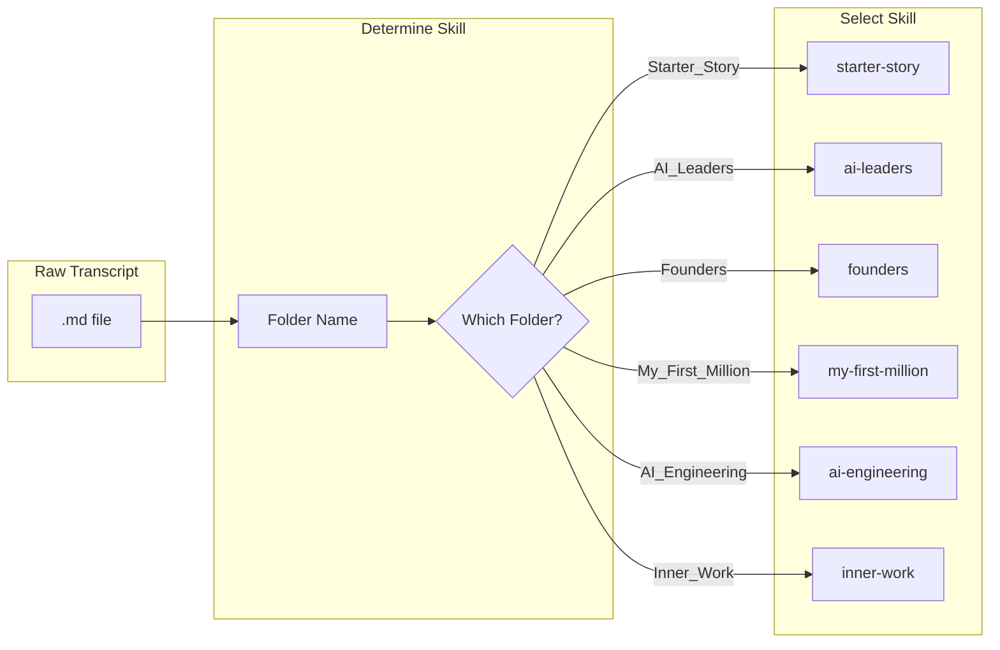
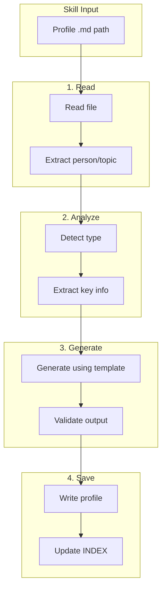
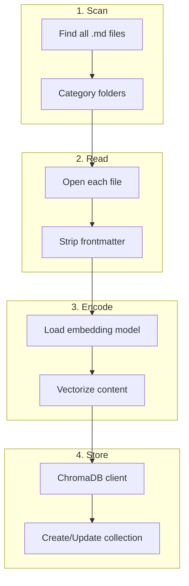
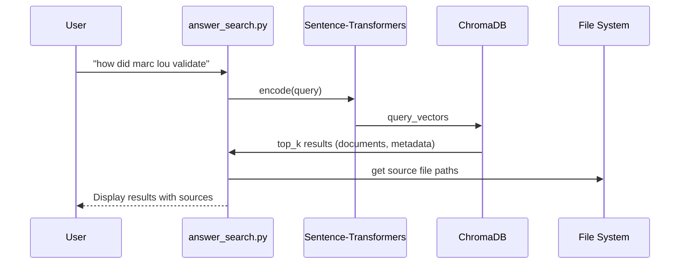
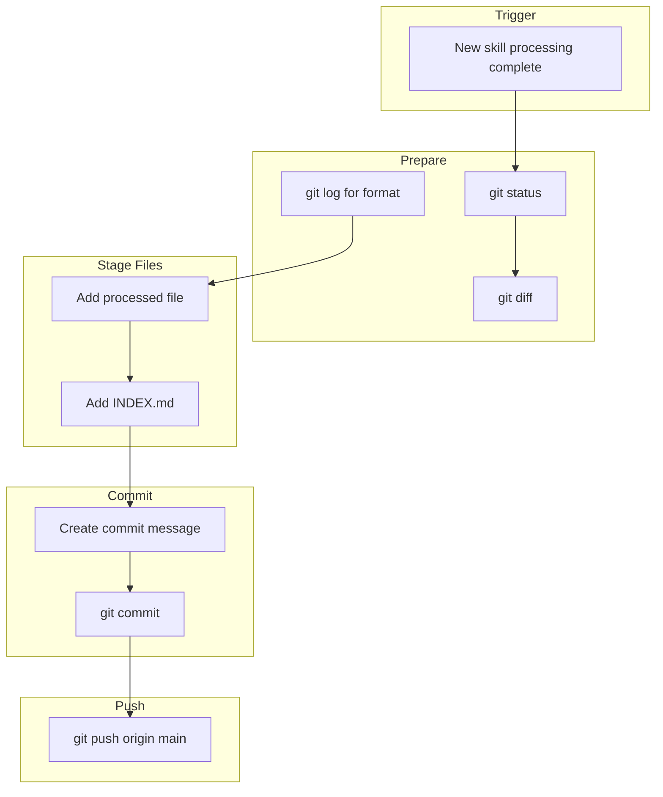
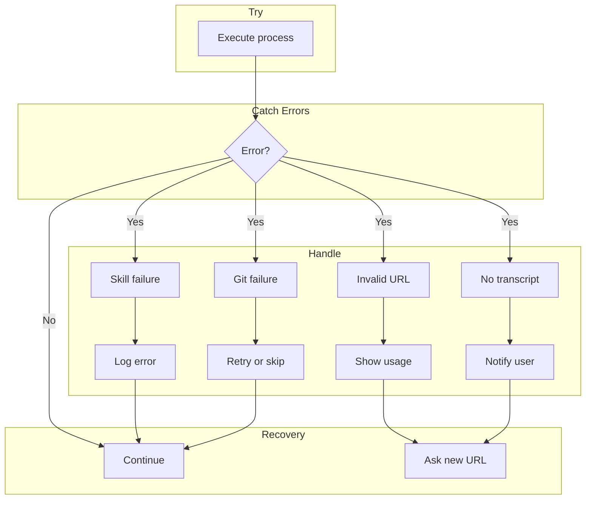

# Workflow Documentation

This document provides detailed workflow diagrams and explanations for all system operations.

---

## Table of Contents

1. [Main Processing Workflow](#main-processing-workflow)
2. [Transcript Extraction Flow](#transcript-extraction-flow)
3. [Skill Processing Flow](#skill-processing-flow)
4. [Search Workflow](#search-workflow)
5. [Git Integration Flow](#git-integration-flow)

---

## Main Processing Workflow

### Overview



---

## Transcript Extraction Flow

### Sequence Diagram



### Code Flow

```python
# Transcript_Extraction.py flow:
1. Parse command line args (url, output_dir)
2. Extract video_id from URL
3. Use yt-dlp to get metadata
4. Use YouTubeTranscriptApi to get transcript
5. Generate markdown with YAML frontmatter
6. Write to file
7. Return success
```

### Error Scenarios

| Error | Cause | Handling |
|-------|-------|----------|
| Invalid URL | Malformed YouTube link | Exit with error message |
| No transcript | Video has no captions | Exit with error message |
| Folder not exists | Invalid folder path | Create folder or exit |

---

## Skill Processing Flow

### Skill Routing Logic



### Skill Processing Steps



### Template Examples

#### Starter Story Template
```markdown
# 🚀 [Founder]: [Company]

[Executive Summary]

# 📊 The Product
[What was built, the gap, unfair advantage]

# 🛠️ Tech Stack & Process
[Tools, build process, time to profit]

# 🎯 Distribution
[First 100 users, scaling engine]

# 🧠 Frameworks & Lessons
[Mental models, key lessons]

# 📈 Key Metrics
[Revenue, growth, team size]
```

#### Founders Template
```markdown
# 📝 Full Context
[Who, what the episode covers]

# 📚 Books & References
[Books written BY, written ABOUT, mentioned]

# 🏛️ Their Founder Thesis
[Core philosophy]

# 💭 Key Lessons
[4-5 main lessons]

# 💬 Notable Quotes
[Best quotes from episode]

# 🚀 Journey & Achievements
[Background, milestones]

# 🏆 Key Metrics
[Company, revenue, growth]
```

---

## Search Workflow

### Index Building Flow



### Search Query Flow



### Search Code Logic

```python
# answer_search.py logic:
1. Parse query from CLI
2. Load sentence-transformers model
3. Encode query → vector
4. Query ChromaDB collection
5. Get top K results
6. Display with relevance scores
7. Show source file paths
```

---

## Git Integration Flow

### Automatic Commit Workflow



### Commit Message Format

| Content Type | Format | Example |
|--------------|--------|---------|
| Transcript | `Add transcript: [title]` | Add transcript: How Roger Federer Works |
| Starter Story | `Add starter story: [founder] - [company]` | Add starter story: Marc Lou - 35 Startups |
| AI Leaders | `Add AI Leaders: [Person] - [Topic]` | Add AI Leaders: Evan Spiegel - Snap |
| Founders | `Add Founders: [Person] - [Topic]` | Add Founders: Roger Federer - Tennis |
| My First Million | `Add My First Million: [Guest/Topic]` | Add My First Million: Chad Gruns |
| AI Engineering | `Add AI Engineering: [Framework/Concept]` | Add AI Engineering: Agentic Engineering |
| Inner Work | `Add Inner Work: [Teacher] - [Topic]` | Add Inner Work: Rabbi Friedman - Love |

---

## Error Handling Workflow

### Processing Errors



---

## Complete End-to-End Example

### Input
```
YouTube URL: https://www.youtube.com/watch?v=g2-duG1-Jxc
Folder: Founders
```

### Steps Executed

| Step | Action | Output |
|------|--------|--------|
| 1 | Extract video_id | `g2-duG1-Jxc` |
| 2 | Fetch metadata | title: "How Roger Federer Works" |
| 3 | Get transcript | Full transcript text |
| 4 | Save to Raw_Data | `g2-duG1-Jxc_How_Roger_Federer_Works..md` |
| 5 | Trigger founders skill | Analyze transcript |
| 6 | Generate profile | Roger-Federer-Tennis-2026.md |
| 7 | Update INDEX | New row added |
| 8 | Commit to Git | "Add Founders: Roger Federer - Tennis" |
| 9 | Push to GitHub | Remote updated |
| 10 | Rebuild index | ChromaDB updated |

### Output Files

**Raw Data:**
```
Founders/Raw_Data/g2-duG1-Jxc_How_Roger_Federer_Works..md
```

**Processed Profile:**
```
Founders/Process_data/Robbi-Federer-Tennis-2026.md
```

**Updated Index:**
```
Founders/INDEX.md (new entry)
```

---

*Last Updated: 2026-05-02*